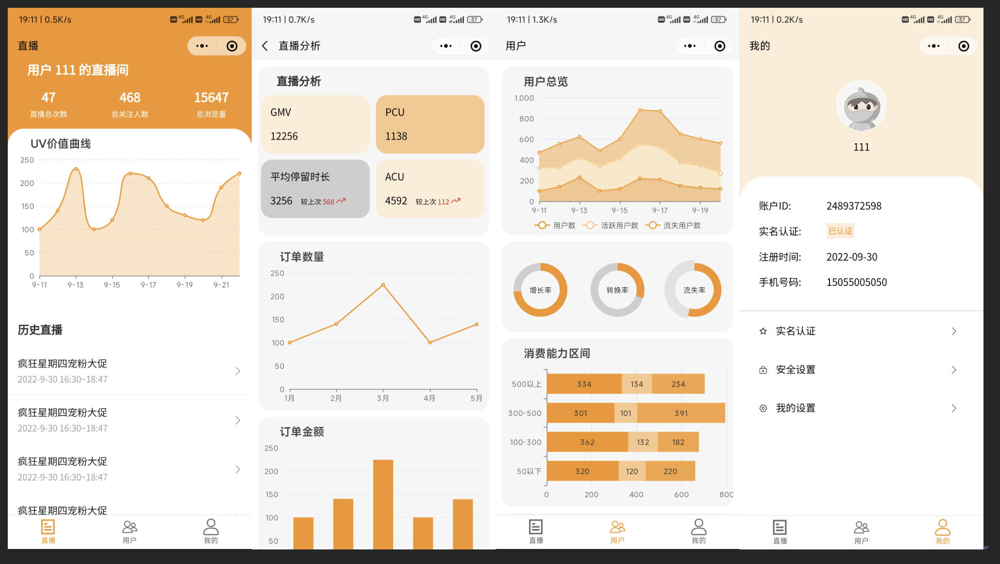

# E-live Data直播电商数据后台-微信小程序端

### 项目介绍
1. 产品定位为通过对直播电商后台数据进行可视化和有效分析，协助用户扩大私域流量，实现精细化运营。
2. 服务对象为直播电商团队中的业务运营。

### 软件架构
1. [微信小程序:](https://developers.weixin.qq.com/miniprogram/dev/framework/) 一种新的开放能力，可以在微信内被便捷地获取和传播，同时具有出色的使用体验。
2. [Apache ECharts:](https://echarts.apache.org/zh/index.html) 一个基于 JavaScript 的开源可视化图表库

### 效果截图
直播、直播分析、用户、我的,页面截图

### 微信扫码体验

### 安装教程

1.  将本项目 clone 到本地，并使用你自己的小程序账号导入项目。 
2.  修改 request/request.js 文件下的 api 地址
3.  编译、预览、真机调试看看效果 

### 更新日志

- 2022年10月6号第一个版本基本功能开发完成,提交审核上线了
- 2022年10月8号第二个版本上线,调整页面主题色调，调整样式，删除无用代码。

